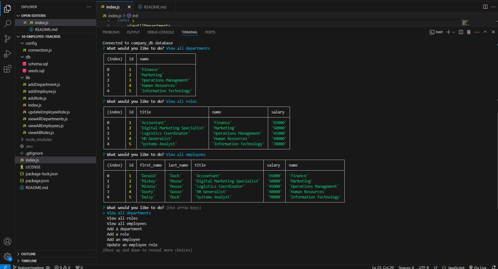

# 10-employee-tracker

  

## Description
The tenth challenge assignment from a bootcamp where the task was to build a command-line application from scratch to manage a company's employee database, using Node.js, Inquirer, and PostgresSQL.

## Table of Content
-[Description](#Description)
-[Process](#Process)
-[Links](#Links)
-[Installation](#Installation)
-[Usage](#Usage)
-[Licenses](#Licenses)
-[Contribution](#Contribution)
-[Test](#Test)
-[Acknowledgement](#Acknowledgement)
-[Questions](#Questions)

## Process
The process included downloading the latest version of Inquirer (8.2.4). In the root index.js file, the inquirer prompt questions are stated in an array for user input. The options being, viewing all departments, viewing all roles, viewing all employees, adding a department/role/employee, and updating an employee role. Additionally, a choice was included to exit the prompt questions, closing the server. A db folder included the schema file where the company database was created for three tables: departments, roles, employees. The seeds file in the db folder added the initial data of five employees. For the actions of viewing and adding to work, when a choice is made in the prompt of questions, a function is run. A folder called lib included the 7 different functions in their separate files for the 7 different choices. Those functions runa query that allows the viewing and adding of a table or row, respectively. Lastly, a connection pool was created in the file connection.js to connect the postgres database to the server. 

## Links
Link to deployed site: https://drive.google.com/file/d/1xM-w4MFCEGdOS1mtH_yGVQ5vfOHO2Rl9/view

## Installation
To install this application, copy the ssh key from my github repo and clone it into your respository. Do an npm install.

## Usage
This site was a practice assignment for bootcamp students but can be used to see how an application made by MySQL works. 

## Licenses
This repository is using the [MIT](https://opensource.org/licenses/MIT) license.

## Contribution
Contact me by email provided in Questions section.

## Test
To test this application, simply open the applcation in VScode and try it out.

## Acknowledgement
Project was done by the knowledge learned from bootcamp instructor John and the Xpert Learning tool.

## Questions
Contact with questions at:

Email: mackenzielmoore14@gmail.com
Click [here](https://github.com/mackemo) for Github account.